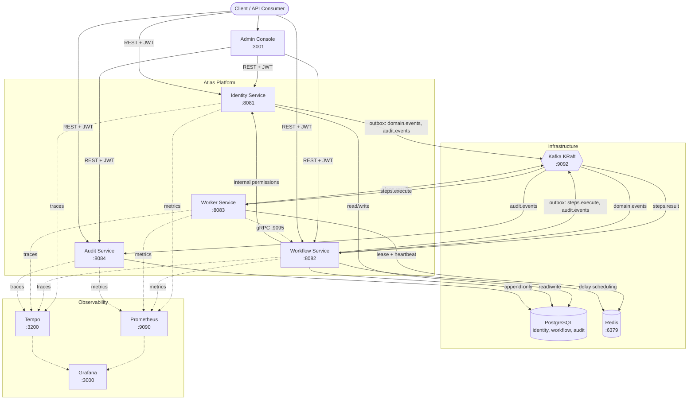

# Atlas

[](https://github.com/OriolJT/atlas/actions/workflows/ci.yml)

**Multi-Tenant Distributed Workflow Orchestration and Event Processing Platform**

Atlas is a multi-tenant distributed platform for durable workflow orchestration, asynchronous execution, and reliable event processing. It is designed to demonstrate end-to-end ownership of a distributed workflow platform under real-world constraints: failure recovery, compensation, multi-tenancy isolation, observability, and operational tooling.



## Key Features

- **Durable workflow orchestration** -- Saga-based execution engine with state machine, retries, compensation, and dead-letter handling
- **Multi-tenancy** -- Tenant-scoped data on every table, enforced at repository + Hibernate filter layers, with tenant-aware RBAC
- **Failure recovery** -- Lease-based crash recovery, stale lease detection, timeout handling, compensation for partial failures
- **Outbox pattern** -- Transactional consistency between database state and Kafka event publishing, with at-least-once delivery
- **Security** -- JWT authentication, role-based access control with fine-grained permissions, BCrypt password hashing, immutable audit trail
- **Three-pillar observability** -- Metrics (Prometheus + Grafana), distributed tracing (Tempo), structured JSON logging -- all correlated
- **Operational tooling** -- Dead-letter inspection and replay, execution timeline API, graceful cancellation, provisioned dashboards and alerting
- **API quality** -- RESTful versioned APIs, idempotency keys, correlation IDs, consistent error payloads, cursor-based pagination

## Tech Stack

| Component | Technology |
|-----------|-----------|
| Language | Java 25 |
| Framework | Spring Boot 4.0.5 |
| Database | PostgreSQL 17 |
| Messaging | Apache Kafka (KRaft mode, no ZooKeeper) |
| Internal RPC | gRPC + Protocol Buffers |
| Caching / Leases | Redis 8 |
| Frontend | React 19 + TypeScript + Vite + Tailwind CSS |
| Observability | Prometheus + Grafana + Tempo |
| Build | Multi-module Maven |
| Testing | JUnit 5 + Testcontainers |
| Infrastructure | Docker Compose, Kubernetes |

## Quick Start

**Prerequisites:** Docker, Docker Compose, Java 25, Maven 3.9+

```bash
# 1. Clone and enter the project
git clone https://github.com/OriolJT/atlas.git && cd atlas

# 2. Start everything (infra + services + seed data)
make up

# 3. Verify all services are healthy
make health
```

All services (Identity, Workflow, Worker, Audit, Admin Console), PostgreSQL, Kafka, Redis, Prometheus, Grafana, and Tempo will be running. Seed data includes a tenant ("Acme Corp"), three users with different roles, and two pre-registered workflow definitions.

**Access points:**

| URL | Description |
|-----|-------------|
| `http://localhost:3001` | Admin Console |
| `http://localhost:3000` | Grafana dashboards (admin/admin) |
| `http://localhost:8081/v3/api-docs` | Identity Service OpenAPI |
| `http://localhost:8082/v3/api-docs` | Workflow Service OpenAPI |

**Default credentials** (tenant slug: `acme-corp`):

| User | Email | Password | Role |
|------|-------|----------|------|
| Admin | `admin@acme.com` | `Atlas2026!` | `TENANT_ADMIN` |
| Operator | `operator@acme.com` | `Atlas2026!` | `WORKFLOW_OPERATOR` |
| Viewer | `viewer@acme.com` | `Atlas2026!` | `VIEWER` |

## Architecture

Atlas uses an orchestration-first architecture. The Workflow Service is the central coordinator that owns execution state, schedules steps, and drives the Worker Service via Kafka commands. Workers are stateless executors that report results back. All Kafka messages from services with databases go through the outbox pattern for transactional consistency.

### Services

| Service | Port | Responsibility |
|---------|------|---------------|
| Identity Service | 8081 | Authentication, tenant management, user management, RBAC, token lifecycle |
| Workflow Service | 8082 | Workflow definitions, execution engine, state machine, compensation orchestration |
| Worker Service | 8083 | Stateless step execution with Redis-backed leases and heartbeats |
| Audit Service | 8084 | Immutable append-only audit trail with filtered queries |
| Admin Console | 3001 | React SPA for dashboard, workflow management, and monitoring |

### Infrastructure

| Component | Port | Purpose |
|-----------|------|---------|
| PostgreSQL | 5432 | Shared database (schemas: `identity`, `workflow`, `audit`) |
| Kafka (KRaft) | 9092 | Asynchronous event transport |
| Redis | 6379 | Worker leases, delay scheduling |
| Prometheus | 9090 | Metrics scraping and alerting |
| Grafana | 3000 | Dashboards and trace visualization |
| Tempo | 3200 | Distributed tracing backend |

### Kafka Topology

| Topic | Producer | Consumer | Partitioning |
|-------|----------|----------|-------------|
| `workflow.steps.execute` | Workflow Service (outbox) | Worker Service | `tenant_id` |
| `workflow.steps.result` | Worker Service | Workflow Service | `tenant_id` |
| `audit.events` | Identity, Workflow (outbox) | Audit Service | `tenant_id` |
| `domain.events` | Identity, Workflow (outbox) | Any interested service | `tenant_id` |

## API Overview

### Identity Service (`:8081`)

| Method | Path | Description |
|--------|------|-------------|
| POST | `/api/v1/auth/login` | Authenticate user (requires `tenantSlug`, `email`, `password`), return JWT + refresh token |
| POST | `/api/v1/auth/refresh` | Rotate refresh token, issue new access token |
| POST | `/api/v1/auth/logout` | Revoke refresh token |
| POST | `/api/v1/tenants` | Create tenant |
| GET | `/api/v1/tenants/{id}` | Get tenant details |
| POST | `/api/v1/users` | Create user |
| GET | `/api/v1/users/{id}` | Get user details |
| POST | `/api/v1/roles` | Create role |
| POST | `/api/v1/roles/{id}/permissions` | Assign permissions to role |
| POST | `/api/v1/service-accounts` | Create service account |
| POST | `/api/v1/api-keys` | Create API key for service account |

### Workflow Service (`:8082`)

| Method | Path | Description |
|--------|------|-------------|
| POST | `/api/v1/workflow-definitions` | Register workflow definition (DRAFT) |
| GET | `/api/v1/workflow-definitions/{id}` | Get definition details |
| POST | `/api/v1/workflow-definitions/{id}/publish` | Publish definition (DRAFT -> PUBLISHED) |
| POST | `/api/v1/workflow-executions` | Start execution (idempotency key required) |
| GET | `/api/v1/workflow-executions/{id}` | Get execution status |
| POST | `/api/v1/workflow-executions/{id}/cancel` | Cancel active execution |
| POST | `/api/v1/workflow-executions/{id}/signal` | Send signal to EVENT_WAIT step |
| GET | `/api/v1/workflow-executions/{id}/timeline` | Get execution event timeline |
| GET | `/api/v1/dead-letter` | List dead-letter items |
| POST | `/api/v1/dead-letter/{id}/replay` | Replay dead-letter item |

### Audit Service (`:8084`)

| Method | Path | Description |
|--------|------|-------------|
| GET | `/api/v1/audit-events` | Query audit events (filtered, paginated) |

All services expose `/actuator/health`, `/actuator/prometheus`, and `/v3/api-docs` (OpenAPI).

## Demo Scenarios

### E-Commerce Order Fulfillment

A 5-step saga with compensation: validate order, reserve inventory, charge payment, create shipment, send notification. If any step fails after retries, previously completed steps are compensated in reverse order.

```bash
# Authenticate
TOKEN=$(curl -s http://localhost:8081/api/v1/auth/login \
  -H "Content-Type: application/json" \
  -d '{"tenantSlug": "acme-corp", "email": "operator@acme.com", "password": "Atlas2026!"}' \
  | jq -r '.accessToken')

# Register the workflow definition
DEFINITION_ID=$(curl -s http://localhost:8082/api/v1/workflow-definitions \
  -H "Authorization: Bearer $TOKEN" \
  -H "Content-Type: application/json" \
  -d @examples/workflows/order-fulfillment.json \
  | jq -r '.id')

# Publish the definition
curl -s -X POST "http://localhost:8082/api/v1/workflow-definitions/${DEFINITION_ID}/publish" \
  -H "Authorization: Bearer $TOKEN"

# Start an execution
EXECUTION_ID=$(curl -s http://localhost:8082/api/v1/workflow-executions \
  -H "Authorization: Bearer $TOKEN" \
  -H "Content-Type: application/json" \
  -H "Idempotency-Key: demo-order-001" \
  -d "{
    \"definition_id\": \"${DEFINITION_ID}\",
    \"input\": {
      \"order_id\": \"ORD-12345\",
      \"customer_id\": \"CUST-001\",
      \"items\": [{\"sku\": \"WIDGET-A\", \"qty\": 2}],
      \"amount_cents\": 4999,
      \"currency\": \"EUR\",
      \"shipping_address\": {\"city\": \"Frankfurt\", \"country\": \"DE\"}
    }
  }" | jq -r '.id')

# Poll execution status
curl -s "http://localhost:8082/api/v1/workflow-executions/${EXECUTION_ID}" \
  -H "Authorization: Bearer $TOKEN" | jq '.status'

# View the execution timeline
curl -s "http://localhost:8082/api/v1/workflow-executions/${EXECUTION_ID}/timeline" \
  -H "Authorization: Bearer $TOKEN" | jq '.events'

# Check the audit trail
curl -s "http://localhost:8084/api/v1/audit-events?resource_id=${EXECUTION_ID}" \
  -H "Authorization: Bearer $TOKEN" | jq '.content'
```

**Triggering compensation:** Start an execution with failure injection to see the saga compensate:

```bash
EXECUTION_ID=$(curl -s http://localhost:8082/api/v1/workflow-executions \
  -H "Authorization: Bearer $TOKEN" \
  -H "Content-Type: application/json" \
  -H "Idempotency-Key: demo-order-fail-001" \
  -d "{
    \"definition_id\": \"${DEFINITION_ID}\",
    \"input\": {
      \"order_id\": \"ORD-99999\",
      \"customer_id\": \"CUST-001\",
      \"items\": [{\"sku\": \"WIDGET-A\", \"qty\": 1}],
      \"amount_cents\": 2999,
      \"currency\": \"EUR\",
      \"shipping_address\": {\"city\": \"Berlin\", \"country\": \"DE\"},
      \"failure_config\": {
        \"fail_at_step\": \"create-shipment\",
        \"failure_type\": \"PERMANENT\"
      }
    }
  }" | jq -r '.id')

# Wait a few seconds, then check -- should be COMPENSATED
curl -s "http://localhost:8082/api/v1/workflow-executions/${EXECUTION_ID}" \
  -H "Authorization: Bearer $TOKEN" | jq '{status, steps: [.steps[] | {name, status}]}'
```

### Incident Escalation

A 4-step workflow with an `EVENT_WAIT` step that times out after 60 seconds, triggering escalation.

```bash
# Register and publish the incident escalation workflow
DEFINITION_ID=$(curl -s http://localhost:8082/api/v1/workflow-definitions \
  -H "Authorization: Bearer $TOKEN" \
  -H "Content-Type: application/json" \
  -d @examples/workflows/incident-escalation.json \
  | jq -r '.id')

curl -s -X POST "http://localhost:8082/api/v1/workflow-definitions/${DEFINITION_ID}/publish" \
  -H "Authorization: Bearer $TOKEN"

# Start an incident
EXECUTION_ID=$(curl -s http://localhost:8082/api/v1/workflow-executions \
  -H "Authorization: Bearer $TOKEN" \
  -H "Content-Type: application/json" \
  -H "Idempotency-Key: demo-incident-001" \
  -d "{
    \"definition_id\": \"${DEFINITION_ID}\",
    \"input\": {
      \"incident_id\": \"INC-5001\",
      \"severity\": \"P1\",
      \"title\": \"Payment service latency spike\",
      \"service\": \"payment-gateway\"
    }
  }" | jq -r '.id')

# Send an acknowledgment signal before the 60s timeout
curl -s -X POST "http://localhost:8082/api/v1/workflow-executions/${EXECUTION_ID}/signal" \
  -H "Authorization: Bearer $TOKEN" \
  -H "Content-Type: application/json" \
  -d '{
    "step_name": "wait-for-acknowledgment",
    "payload": {"acknowledged_by": "oncall-engineer-42"}
  }'

# Check final status
curl -s "http://localhost:8082/api/v1/workflow-executions/${EXECUTION_ID}" \
  -H "Authorization: Bearer $TOKEN" | jq '.status'
```

## System Guarantees

| Guarantee | Mechanism |
|-----------|-----------|
| A workflow step is executed at least once, never zero times | Outbox pattern + timeout detector re-publishes on worker crash |
| A step result is processed at most once per attempt | Deduplication by `step_execution_id` + `attempt_count` |
| Workflow state transitions are monotonic and durable | State machine rejects invalid transitions; every transition is a DB write in a transaction |
| Compensation executes only for completed steps, in reverse order | Compensation engine queries `SUCCEEDED` steps ordered by `finished_at DESC` |
| Idempotent execution creation | `UNIQUE` constraint on `(tenant_id, idempotency_key)` |
| Tenant data is never accessible across tenant boundaries | Triple enforcement: JWT validation + Hibernate `@Filter` + repository WHERE clause |
| No event is lost if Kafka is temporarily unavailable | Outbox retains unpublished rows until Kafka publish succeeds |
| Audit events are never lost, never duplicated | At-least-once delivery + idempotent insert (`ON CONFLICT DO NOTHING`) |
| Non-retryable failures skip retry budget | `non_retryable` flag in step result bypasses retries, goes directly to dead-letter |
| Dead-letter replay gives a fresh retry budget | Replay resets `attempt_count` to zero and transitions execution back to `RUNNING` |

## Project Structure

```
atlas/
├── pom.xml                          # Parent POM (dependency management)
├── Dockerfile                       # Multi-stage build for all services
├── Makefile                         # Build, test, deploy commands
├── common/                          # Shared module (events, security, web filters)
│   └── src/main/java/com/atlas/common/
│       ├── event/                   # Event envelope, domain event types, outbox entity
│       ├── security/                # JWT utils, permission annotation
│       ├── web/                     # Error response, correlation ID filter, pagination
│       └── domain/                  # Shared value objects (TenantId, UserId, ExecutionId)
├── identity-service/                # Port 8081 — Auth, tenants, users, RBAC
│   └── src/main/java/com/atlas/identity/
├── workflow-service/                # Port 8082 — Definitions, execution engine
│   └── src/main/java/com/atlas/workflow/
├── worker-service/                  # Port 8083 — Stateless step execution
│   └── src/main/java/com/atlas/worker/
├── audit-service/                   # Port 8084 — Immutable audit trail
│   └── src/main/java/com/atlas/audit/
├── admin-console/                   # Port 3001 — React SPA (Vite + Tailwind)
│   └── src/
├── proto/                           # Protocol Buffer definitions for gRPC
│   └── atlas/
├── infra/
│   ├── docker-compose.yml           # Full stack: services + infra + observability
│   ├── grafana/                     # Dashboard provisioning (JSON)
│   ├── prometheus/                  # prometheus.yml + alerts.yml
│   ├── kafka/                       # Topic creation scripts
│   ├── postgres/                    # Schema initialization
│   └── tempo/                       # Tracing configuration
├── k8s/                             # Kubernetes manifests for production deployment
├── docs/                            # Architecture, API docs, tradeoffs, production guide
├── tests/
│   ├── e2e/                         # End-to-end test suite
│   └── load/                        # Load testing scripts
├── scripts/                         # seed.sh and dev helpers
└── examples/
    └── workflows/                   # Demo workflow JSON definitions
```

## Testing

```bash
# Run all tests (unit + integration with Testcontainers)
make test

# Build without tests
make build

# Run end-to-end tests (requires running stack)
make e2e
```

**Test coverage:**

- **Unit tests** -- Domain rules, state machine transitions, retry delay calculations, authorization logic, compensation ordering
- **Integration tests (Testcontainers)** -- Repository tests with real PostgreSQL, Kafka event publishing and consumption, Redis lease acquisition
- **End-to-end tests** -- Full workflow lifecycle: authenticate, create definition, start execution, verify completion, inspect audit trail
- **Failure tests** -- Duplicate event delivery (idempotency), stale lease recovery, outbox publication recovery, dead-letter replay
- **Load tests** -- Performance and throughput testing under concurrent workflow executions

## Design Decisions and Tradeoffs

| Decision | Rationale |
|----------|-----------|
| **At-least-once over exactly-once** | Simpler implementation. Idempotent handlers achieve effectively-once semantics without distributed transactions. |
| **Orchestration over choreography** | Centralized state makes debugging, compensation, and timeline reconstruction straightforward. |
| **Shared DB with tenant scoping over DB-per-tenant** | Sufficient isolation for v1 with less operational overhead. Evolvable to schema-per-tenant. |
| **Redis for leases and scheduling** | Ephemeral by nature. Lost leases are recovered by timeout detection. Redis failure = temporary stall, not data loss. |
| **Compensation is best-effort and continues on failure** | All compensation steps are attempted even if some fail. Failures are recorded, dead-lettered, and visible for operator intervention. |
| **4 services, not more** | Depth over breadth. Each service has real complexity and production-grade implementation. |
| **HS256 over RS256 for JWT signing** | Simpler key management (shared secret). Evolvable to asymmetric signing when service count grows. |
| **State machine over replay engine** | No determinism constraint on workflow logic. Recovery reads last persisted state and resumes. Simpler than Temporal-style replay. |
| **Kafka over DB polling for step dispatch** | Push-based delivery is immediate. Consumer group scaling is automatic. No polling pressure on the database. |

## Makefile Commands

| Command | Description |
|---------|-------------|
| `make build` | Build all modules (skip tests) |
| `make test` | Run all tests |
| `make infra-up` | Start infrastructure (Postgres, Kafka, Redis, Prometheus, Grafana, Tempo) |
| `make infra-down` | Stop infrastructure |
| `make app-up` | Build and start application services |
| `make app-down` | Stop application services |
| `make up` | Start everything (infra + app + seed data) |
| `make down` | Stop everything |
| `make seed` | Run seed script (create users, definitions) |
| `make health` | Check health of all services |
| `make e2e` | Run end-to-end tests |

## Documentation

| Document | Description |
|----------|-------------|
| [Architecture](docs/architecture.md) | System design, event flows, and service interactions |
| [API Reference](docs/api.md) | Full endpoint documentation with request/response examples |
| [Design Tradeoffs](docs/tradeoffs.md) | Rationale behind key architectural decisions |
| [Local Setup](docs/local-setup.md) | Development environment setup guide |
| [Demo Guide](docs/demo-guide.md) | Step-by-step walkthrough of demo scenarios |
| [Production Deployment](docs/production/deployment-guide.md) | Kubernetes deployment and configuration |
| [Scaling Guide](docs/production/scaling-guide.md) | Performance tuning and horizontal scaling |
